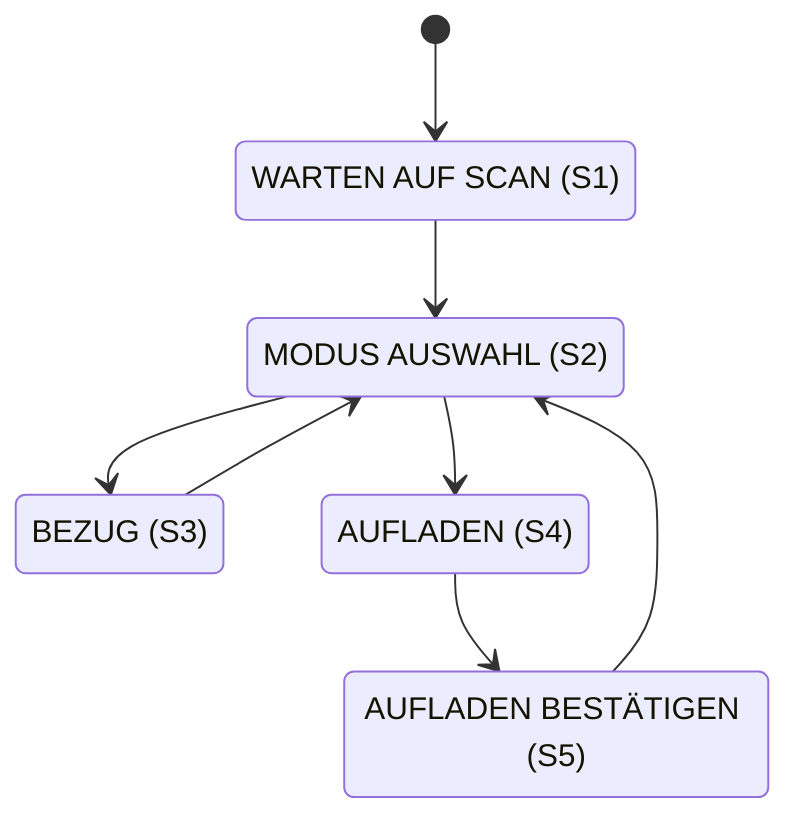
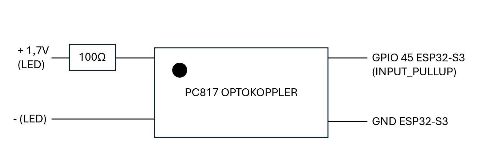

## PINOUT
| Modul       | Signal       | GPIO    |
|-------------|--------------|---------|
| **RFID**    | CS ("SDA")   | GPIO 4  |
| **DISPLAY** | CS           | GPIO 15 |
|             | RS/DC        | GPIO 16 |
|             | RST          | GPIO 7  |
| **SD-Karte**| CS           | GPIO 47 |
| **ENCODER** | SW           | GPIO 42 |
|             | DT ("B")     | GPIO 40 |
|             | CLK ("A")    | GPIO 41 |
| **RELAIS**  | GPIO         | 48      |

## SPI-Bus-Zuweisungen

### SPI für SD-Karte

| Signal | GPIO |
|--------|------|
| SCK    | 19   |
| MISO   | 20   |
| MOSI   | 21   |

### SPI für TFT & RFID

| Signal     | GPIO |
|------------|------|
| SCK        | 36   |
| MISO       | 37   |
| MOSI (SDA) | 35   |

## Aufbau der Datenbank

| ID_LOW  | ID_HIGH       | SALDO   | COUNTER |
|-----|------------|---------|---------|
| 1234   | 5678 | 20.50  | 3456       |

## Aufbau State Machine

## Schaltung Optokoppler (STATE LED ON/OFF)

